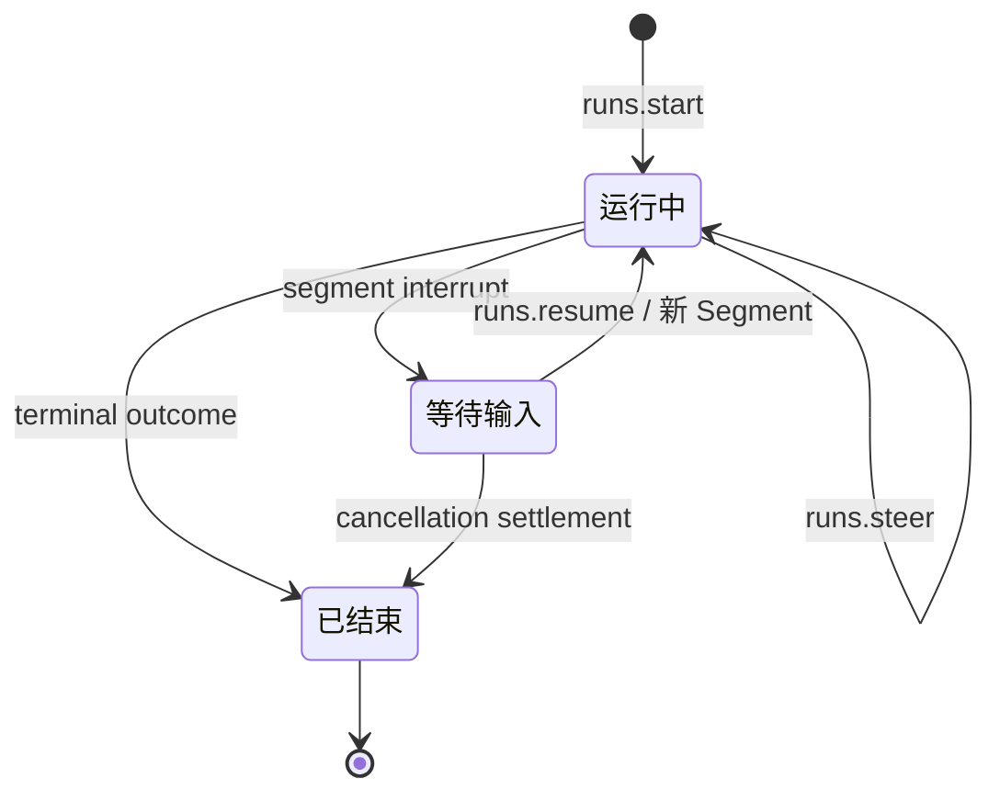

# Flame 核心 AI 流式协议分析

## 对照 OpenCode v2 与 Codex main：语义、状态同步、恢复与演进取舍

**报告日期：2026-09-21**\
**用途：为 Flame 的前后端协议改进提供设计依据；本报告不包含仓库代码修改。**\
**配套报告：《Flame 旁路 API 分析》覆盖文件系统、diff、skills、MCP、配置、进程和资源更新。**

## 1. 核心判断

Flame 当前需要的不是换成另一家的传输协议，也不是重新建立 Session、Run 或事件恢复体系。它已经拥有明确的 Runtime 权威、Session / Run / Segment / Item 分层、命令幂等、权威事件与临时预览分离、有限回放、快照与后续事件的衔接，以及客户端恢复路径。参考项目的价值，在于帮助我们检验这些机制是否真正降低了客户端理解和使用成本，并明确哪些产品体验还缺少可解释的事实。

本报告建议：

**优先核查并修正核心权威 fold 的异常恢复边界**：当前核心 handler 也会被插件异常隔离捕获，批次仍可能被接纳并推进游标。应将失败显式交回现有恢复 owner，详见 §7.5 与 C0。这是源码路径发现，未进行故障注入复现。

1. **保留 Flame 的 Session / Run / Segment / Item 模型。** Segment 表达一次连续执行阶段，Run 可以跨越等待和恢复；不能因为 Codex 使用 Turn 就把 Run 改名或压平。
2. **保留显式的 start / steer / resume / cancel。** 用户是在发起新任务、改变正在进行的任务，还是回答已有中断，需要协议给出明确语义。
3. **保留“预览可丢，最终事实可恢复”。** 接收到多少 delta，不能成为最终消息、工具结果和运行结论的唯一依据。
4. **保留有边界的回放和冷恢复。** 不为参考 OpenCode 而默认引入全量事件存储，也不为参考 Codex 而移除已有游标和快照保障。
5. **学习输入接纳状态、历史读取的完整性标记和生命周期屏障。** 先检查 Flame 已有事实是否足够；只为确实无法表达的产品语义增加字段或资源。
6. **把传输、运行状态和外部副作用分开判断。** 连接断开不等于 Run 失败，历史恢复不等于执行恢复，命令重放保护不等于外部操作具有永久的 exactly-once 保证。

上述判断基于 Flame 的[项目所有权约束](https://github.com/Tangerg/flame/blob/5989445dbd787c0914a72013bb511b9a08399138/PROJECT_RULES.md)、[Run 协议](https://github.com/Tangerg/flame/blob/5989445dbd787c0914a72013bb511b9a08399138/runtime/protocol/runs.go)、[事件协议](https://github.com/Tangerg/flame/blob/5989445dbd787c0914a72013bb511b9a08399138/runtime/protocol/events.go)和[方法语义注册](https://github.com/Tangerg/flame/blob/5989445dbd787c0914a72013bb511b9a08399138/runtime/internal/delivery/method.go)。后文区分已实现能力、设计取舍和建议增量，不把不同实现风格直接当作缺陷。

## 2. 分析基线与证据边界

| 项目 | 本次指定分支 | 固定提交 |
| --- | --- | --- |
| Flame | main | [5989445dbd787c0914a72013bb511b9a08399138](https://github.com/Tangerg/flame/commit/5989445dbd787c0914a72013bb511b9a08399138) |
| OpenCode | v2 | [2f0c861af098ec914a19751fe62d715448f6bf84](https://github.com/anomalyco/opencode/commit/2f0c861af098ec914a19751fe62d715448f6bf84) |
| Codex | main | [40eeb6e8a89ef421c25d4c40e06fa1d40ce66b4f](https://github.com/openai/codex/commit/40eeb6e8a89ef421c25d4c40e06fa1d40ce66b4f) |

仓库和文件通过 GitHub 插件读取。三个递归目录树均返回完整结果，随后按协议定义、注册入口、后端处理器、实际消费者和相关测试交叉追踪；所有结论以固定提交为准。这里的“覆盖”指相关协议族和主要生命周期路径，不表示逐行审查了三个仓库的全部业务代码。

本次是**静态源码与测试代码分析**，没有启动三套应用，没有调用真实模型，没有执行端到端、故障注入、性能或完整测试套件。引用测试意味着已有测试明确表达相应契约，不意味着本次已经运行通过。对于性能收益、极端故障和新增能力，本报告提供验证条件，不把推断包装为实测结果。

Flame 的工程约束明确要求一个事实只有一个推进者、Runtime 拥有持久产品语义、CLI 与 Desktop 只保留可重建的投影；同时强调 KISS / YAGNI，不复制参考仓库的目录、兼容负担或框架抽象。这些约束是本报告的取舍依据。本次只生成独立报告，未修改 Flame、OpenCode 或 Codex 的源代码。[AGENTS.md](https://github.com/Tangerg/flame/blob/5989445dbd787c0914a72013bb511b9a08399138/AGENTS.md)、[设计哲学](https://github.com/Tangerg/flame/blob/5989445dbd787c0914a72013bb511b9a08399138/DESIGN_PHILOSOPHY.md)、[参考项目规则](https://github.com/Tangerg/flame/blob/5989445dbd787c0914a72013bb511b9a08399138/DEVELOPMENT.md)

### 2.1 这份报告讨论哪一层协议

| 层次 | 典型内容 | 对 Flame 的边界要求 |
| --- | --- | --- |
| 模型提供商 → 框架 | token / reasoning / tool-call 增量、完整模型响应、provider 错误 | 由 Scope 和 provider 适配层理解，不能直接成为客户端业务状态机 |
| Runtime 内部执行 | 工具执行、暂停、子 Run、提交、恢复、外部结果不确定性 | 由 Runtime 与 Scope 的既有所有权边界处理 |
| Runtime → CLI / Desktop | Session、Run、Segment、Item、Plan、中断、事件和读模型 | 本报告的核心；必须给出产品可依赖的状态和失败语义 |
| 客户端呈现 | 草稿、焦点、输入框、预览、加载与重连提示 | 可以拥有交互状态，不能自行推进持久 Run 的业务结论 |

Flame 已明确把经过验证的完整模型响应、失败流的可保留前缀和不确定外部结果分开处理；不能把“供应商流结束”直接折叠成“Run 成功”。这些内容在 Runtime 的[执行与结算说明](https://github.com/Tangerg/flame/blob/5989445dbd787c0914a72013bb511b9a08399138/runtime/README.md#scope-execution-settlement)中有明确边界，也必须延续到客户端展示。

## 3. 三家的名词不是可直接替换的同义词

| 产品含义 | Flame | OpenCode v2 | Codex main |
| --- | --- | --- | --- |
| 长期对话和历史容器 | Session | Session | Thread |
| 一次产品任务执行 | Run | 没有可直接对等的独立 Run 资源；由 session execution、inbox、message / step 等表达 | Turn 最接近，但其控制和重入行为与 Flame Run 不同 |
| 连续执行到暂停或终止的一段 | Segment | execution / step 内部阶段，不能按名字等同 | Turn 内部执行和等待；没有与 Flame Segment 完全对等的公开资源 |
| 用户可见的内容事实 | Item，含文本、工具等类型 | Message / Part 与对应投影 | ThreadItem，挂在 Thread / Turn 下 |
| 等待人类输入 | Run waiting + 完整 PendingInterruptSet | Permission / Form 等公开资源与执行等待 | ServerRequest 与审批、补充输入响应；同时提供相关状态和恢复机制 |
| 输入在执行前排队 | 按既有 start / steer 等契约处理；需要区分命令接纳与模型消费 | durable inbox admission 是核心设计 | turn/start 可启动或 steer；另有实验性 thread/queue 方法 |
| 子任务关系 | parentRunId / rootRunId / spawnedByItemId | 子 session 及相应执行关系 | 子 thread / agent 关系；Thread.sessionId 还可表示同一 session tree 的共享标识 |

这个映射是语义上的近似对照，不是类型转换表。尤其不能把 Codex 当前的 Thread.sessionId 直接映射为 Flame 的 Session ID，也不能把 OpenCode 的 step 理解成跨多个模型调用和人工等待的完整 Run。[Flame Run 类型](https://github.com/Tangerg/flame/blob/5989445dbd787c0914a72013bb511b9a08399138/runtime/protocol/runs.go)、[OpenCode Session schema](https://github.com/anomalyco/opencode/blob/2f0c861af098ec914a19751fe62d715448f6bf84/packages/schema/src/session.ts)、[Codex Thread 协议](https://github.com/openai/codex/blob/40eeb6e8a89ef421c25d4c40e06fa1d40ce66b4f/codex-rs/app-server-protocol/src/protocol/v2/thread_data.rs#L201-L223)

### 3.1 Flame 应保留的状态分解

Flame Run 的状态回答“现在是否还在执行”：running、waiting、finished。终局 outcome 回答“为什么最终结束”：completed、timedOut、failed、canceled、lost。Segment 除了终局结果，还允许 interrupt 和 suspended；一个 Segment 停止，不必然代表 Run 已结束。[状态和结果定义](https://github.com/Tangerg/flame/blob/5989445dbd787c0914a72013bb511b9a08399138/runtime/protocol/runs.go#L7-L218)

这个分解服务于真实的人工中断和子任务等待，值得保留。UI 可以把它压缩成更容易理解的文案，但不能把 waiting 当作失败，也不能把每个 segment.finished 都当作任务完成。

对于根 Run 的主线，可以理解为：

图中没有“连接断开 → Run 失败”这条边；连接状态属于观察者。子树暂停与取消需要结合 rootRunId 和中断集合判断，不能把子 Run 的局部结果直接升级为根 Run 的结论。

## 4. 先确认 Flame 已有什么，避免重复建设

固定提交的生成 manifest 声明 **87 个方法、4 个流式方法和 2 个通知名称**。核心 Run 事件类型只有 7 个：其中 segment.progress 与 item.delta 为临时预览，另外 5 类是权威、可在既定窗口内回放的事件。方法数量仅用于核对接口面，不作为优劣评分。[生成 manifest](https://github.com/Tangerg/flame/blob/5989445dbd787c0914a72013bb511b9a08399138/runtime/contract/manifest.json)

| 已有能力 | 当前实现意义 | 本次判断 |
| --- | --- | --- |
| 单一语义入口 | Go binding 与 Runtime Protocol 进入同一 delivery endpoint | 保留；不要再建只服务 Desktop 的平行 Run 控制器 |
| 方法的业务语义与响应形式分离 | query / command / subscription 与 unary / stream 分开 | 保留；“会流式返回”不等于一种业务操作 |
| 命令重放策略集中注册 | unary command 重放首次响应，开 Run 的命令重放并重新附着既有流 | 保留；不能只重放一个 runId 后让客户端失去观察通道 |
| 权威事件和预览分开 | delta 可以丢，完整 Item 与终局事实负责收敛 | 保留；无需持久化每个 token 才能实现可靠 UI |
| replay 能力有明确范围 | Runtime instance + root Segment，受事件数和字节数限制 | 保留并正确消费；不能宣称跨重启无限回放 |
| snapshot 与后续订阅衔接 | runs.subscribe 支持 snapshot=true 和 successor tail | 保留；避免客户端自己拼接互相竞争的独立读写者 |
| 冻结 Run 协议能力 | subagents 等会改变权威流形状的能力在 Run admission 时确定 | 保留；后续客户端能力不足时拒绝，不能无声降级成不完整历史 |
| 结构化恢复建议 | refetch、coldRecover、resubscribe、reauthenticate 等 | 保留；恢复动作不能覆盖命令幂等条件，也不能自动授权重做用户意图 |

证据：[方法语义与注册校验](https://github.com/Tangerg/flame/blob/5989445dbd787c0914a72013bb511b9a08399138/runtime/internal/delivery/method.go)、[能力与回放边界](https://github.com/Tangerg/flame/blob/5989445dbd787c0914a72013bb511b9a08399138/runtime/protocol/capabilities.go)、[冻结能力](https://github.com/Tangerg/flame/blob/5989445dbd787c0914a72013bb511b9a08399138/runtime/protocol/features.go)、[恢复动作](https://github.com/Tangerg/flame/blob/5989445dbd787c0914a72013bb511b9a08399138/runtime/protocol/errors.go)、[快照订阅请求](https://github.com/Tangerg/flame/blob/5989445dbd787c0914a72013bb511b9a08399138/runtime/protocol/runs.go#L366-L392)

以上已经是有明确产品语义的协议，后续改进应作用于这些现有所有者，而不是为“统一”或“现代化”增加第二套抽象。

## 5. 传输形式：三家解决的是同一类问题，但承担的成本不同

| 维度 | Flame | OpenCode v2 | Codex main |
| --- | --- | --- | --- |
| 主要业务入口 | POST /v2/rpc；方法级 unary 或 response + SSE | 按资源划分的 HTTP API；全局 event SSE，另有实验日志流 | JSON-RPC 风格请求、响应、通知、服务端请求；stdio / WebSocket / 进程内 |
| 命令与观察关联 | 同一 HTTP 调用的结果和通知由 requestRpcId 关联，再绑定 Run / Segment | 多个 HTTP 操作与共享事件流关联到 session / message 等对象 | 请求 ID 关联回应；事件用 threadId / turnId / itemId |
| 双向交互 | 客户端通过显式命令回答 Runtime 持有的中断 | Permission / Form 的查询与回复 API | 服务端可发送需要客户端回应的 ServerRequest |
| 初始化与能力 | protocolVersion、discover、客户端能力、冻结 Run profile | schema / 生成 client + 运行时资源目录；实验路径 | initialize 与连接级能力；experimental opt-in |
| 不应推导的结论 | 用 SSE 不代表只能做聊天 | 用 REST 不代表资源一致性天然简单 | 用 WebSocket 或 JSON-RPC 风格不代表天然有日志重放 |

Flame 前端预先注册 observer，在 ACK 尚未给出 Segment ID 时以 requestRpcId 收帧，之后再绑定根 Segment；响应 ID 与源请求不一致只失败相应调用，避免错误包结算另一个请求。这是现有可靠交互的组成部分。[前端流建立](https://github.com/Tangerg/flame/blob/5989445dbd787c0914a72013bb511b9a08399138/desktop/frontend/src/rpc/stream.ts#L227-L300)、[RPC 关联校验](https://github.com/Tangerg/flame/blob/5989445dbd787c0914a72013bb511b9a08399138/desktop/frontend/src/rpc/client.ts#L130-L164)

Codex 当前明确不发送、也不要求顶层 jsonrpc: "2.0"，准确说法应是 JSON-RPC 风格协议。其 initialize 返回并非完整协议版本交集协商；experimental capability 属于连接，代码还记录了共享 Thread 在不同连接能力下的边界问题。[Codex envelope](https://github.com/openai/codex/blob/40eeb6e8a89ef421c25d4c40e06fa1d40ce66b4f/codex-rs/app-server-protocol/src/rpc.rs#L1-L89)、[初始化实现](https://github.com/openai/codex/blob/40eeb6e8a89ef421c25d4c40e06fa1d40ce66b4f/codex-rs/app-server/src/request_processors/initialize_processor.rs#L66-L150)、[初始化请求与响应定义](https://github.com/openai/codex/blob/40eeb6e8a89ef421c25d4c40e06fa1d40ce66b4f/codex-rs/app-server-protocol/src/protocol/v1.rs#L29-L89)

**对 Flame 的决定：维持当前承载。** 只有交互终端、浏览器双向高频 IO、明确远端部署等真实需求证明现有承载不合适时，再为对应能力选用别的通道。不要把所有旁路调用改成 REST，也不要为对齐 Codex 引入一条全局双向 socket 和第二套请求生命周期。独立客户端 SDK 可以统一易用入口，但不能吞掉幂等、流建立失败和未知结果等语义。

## 6. 输入与控制：成功响应到底承诺了什么

### 6.1 不把所有 ACK 都解释成“完成”

| 操作 | 实际承诺 | 客户端不能自行补出的结论 |
| --- | --- | --- |
| Flame runs.start | 返回已创建的 runId、segmentId、userItemId，并建立该调用的事件观察 | 模型已产生回答、工具已运行、任务已成功 |
| Flame runs.steer | 当前目标 Segment 接受了向 Scope 递交的信号；后来才在真实消费归属边界提交用户输入事实 | HTTP 成功就等于该输入已进入某次模型请求 |
| Flame runs.resume | 对已存在 Run 的中断集合作答，返回后继 Segment 身份 | 创建了与旧 Run 无关的新任务 |
| Flame runs.cancel 成功 | 等待 owner 结算后返回已经提交的 canceled Run；子 Run 还带同边界的 root 快照 | 任何迟到取消都能覆盖自然完成或失败 |
| OpenCode prompt | 输入及材料被接纳进持久 Inbox；唤醒执行与消费另有边界 | provider 已接收输入、模型已经理解 |
| OpenCode interrupt | interrupted 表示对当前执行的中断是否被接受；清理与结算异步 | 返回 true 之后所有工具、清理及后继工作都已停止 |
| Codex turn/start | 可能新建 Turn，也可能向当前 Turn steer；返回 inProgress、未载入 items 的对象 | 每次调用一定创建一个新的 Turn |
| Codex 普通 turn/interrupt | 常规路径等待相应中断/完成处理再回应；有活动启动期特例 | 一律只是收到命令，或一律必定以 interrupted 终结 |

证据：[Flame 请求与响应](https://github.com/Tangerg/flame/blob/5989445dbd787c0914a72013bb511b9a08399138/runtime/protocol/runs.go#L218-L306)、[Flame cancel 结算屏障](https://github.com/Tangerg/flame/blob/5989445dbd787c0914a72013bb511b9a08399138/runtime/internal/application/agent/runs/cancellation.go#L51-L103)、[Flame steering 消费归属](https://github.com/Tangerg/flame/blob/5989445dbd787c0914a72013bb511b9a08399138/runtime/internal/adapter/agentexec/interaction_control.go#L69-L160)、[OpenCode 接纳与交付](https://github.com/anomalyco/opencode/blob/2f0c861af098ec914a19751fe62d715448f6bf84/packages/core/src/session/projector.ts#L601-L628)、[OpenCode interrupt](https://github.com/anomalyco/opencode/blob/2f0c861af098ec914a19751fe62d715448f6bf84/packages/core/src/session/run-coordinator.ts#L147-L195)、[Codex start-or-steer](https://github.com/openai/codex/blob/40eeb6e8a89ef421c25d4c40e06fa1d40ce66b4f/codex-rs/app-server/src/request_processors/turn_processor.rs#L647-L714)、[Codex interrupt](https://github.com/openai/codex/blob/40eeb6e8a89ef421c25d4c40e06fa1d40ce66b4f/codex-rs/app-server/src/request_processors/turn_processor.rs#L1591-L1659)、[自然完成竞争的回应](https://github.com/openai/codex/blob/40eeb6e8a89ef421c25d4c40e06fa1d40ce66b4f/codex-rs/app-server/src/bespoke_event_handling.rs#L185-L203)

Flame cancel 的细节值得保留：如果自然完成或失败已经先结算，取消路径可以返回 run_finished，让客户端读实际结果，而不伪造 canceled。UI 只有在取消命令还未完成时才展示“正在停止”；已拿到成功的取消响应后，应接受其中的权威终态，不能为了套用 OpenCode 的模型继续等待一个可能已经错过的通知。[取消映射](https://github.com/Tangerg/flame/blob/5989445dbd787c0914a72013bb511b9a08399138/runtime/internal/delivery/runs_control.go)、[取消结算实现](https://github.com/Tangerg/flame/blob/5989445dbd787c0914a72013bb511b9a08399138/runtime/internal/application/agent/runs/cancellation.go)

### 6.2 最有价值的新增候选：让追加输入可解释

OpenCode Inbox 提供 enqueued / delivered 和可取消的 pending 输入；Codex 有实验性 queue API，以及方便发送按钮使用的 start-or-steer。二者共同提示：**用户输入的生命周期与 Run 的生命周期不是同一件事。** [Codex queue 注册与实验标记](https://github.com/openai/codex/blob/40eeb6e8a89ef421c25d4c40e06fa1d40ce66b4f/codex-rs/app-server-protocol/src/protocol/common.rs#L631-L665)

Flame 当前已经有 steer，并通过 expectedSegmentId 防止旧界面的追加输入进入用户没有观察到的新 Segment。现有内部 signalID 和后续 SteerMessagesApplied 归属说明“已接受”与“已应用”确实是两个边界；公开 runs.steer 的空成功响应尚未暴露这段关联。[Flame steer 目标保护](https://github.com/Tangerg/flame/blob/5989445dbd787c0914a72013bb511b9a08399138/runtime/protocol/runs.go#L288-L300)、[实际消费归属](https://github.com/Tangerg/flame/blob/5989445dbd787c0914a72013bb511b9a08399138/runtime/internal/adapter/agentexec/interaction_control.go#L69-L160)

前端还有一个更具体的关联问题：追加输入先以 local-steer-*、runId=null 建立本地占位；ACK 只结算发送 effect，不会制造权威 Item。后续权威用户消息到达时，fold 按提取后的文字查找第一个同文占位，并替换其身份。当前匹配没有比较附件内容，因此同文多次追加、相同文字配不同图片、纯图片输入都缺少精确对应依据。这里是源码显示的关联弱点，尚未运行复现错配或数据损坏。[本地占位](https://github.com/Tangerg/flame/blob/5989445dbd787c0914a72013bb511b9a08399138/desktop/frontend/src/plugins/builtin/agent/adapters/optimisticUserMessage.ts#L28-L35)、[发送与 ACK](https://github.com/Tangerg/flame/blob/5989445dbd787c0914a72013bb511b9a08399138/desktop/frontend/src/plugins/builtin/agent/application/input/chatSend.ts#L76-L105)、[按内容折叠](https://github.com/Tangerg/flame/blob/5989445dbd787c0914a72013bb511b9a08399138/desktop/frontend/src/plugins/builtin/agent/application/fold/fold.ts#L188-L232)

可按需求分两步改进：

- **当前即可做的语义澄清**：提交成功提示为“补充已接受”，不要宣称“模型已使用”。一旦 Run 在消费前停止，不能把尚未应用的输入画成已经影响过回答的历史。
- **优先补精确关联，再按需求扩大生命周期**：由现有输入 owner 提供稳定 admission identity，或预留将来使用的 userItemId，并随真实应用事实带回，使 UI 不再按文本猜配对。预留身份不等于 Item 已经提交，ACK 也不等于模型已使用。只有需要可见排队、撤回或重启对账时，再扩大持久状态；若增加状态，必须分别有“已登记、进入请求快照、被取消或未能应用”的事实依据。

不建议现在复制完整 Inbox 管理系统。尤其是 OpenCode 的 delivered 只证明输入已从 pending 原子移入会话历史，仍不证明 provider 已发送或模型已理解；Flame 的应用回执必须由实际 Scope 消费边界产生，不能只换一组更漂亮的状态名。[OpenCode Inbox](https://github.com/anomalyco/opencode/blob/2f0c861af098ec914a19751fe62d715448f6bf84/packages/core/src/session/inbox.ts#L319-L355)、[交付投影](https://github.com/anomalyco/opencode/blob/2f0c861af098ec914a19751fe62d715448f6bf84/packages/core/src/session/projector.ts#L601-L628)

### 6.3 保持 Runtime 命令明确，让 UI 决定交互入口

Codex 的 start-or-steer 可以减少调用方判断，但也会使“start”不再代表严格创建。Flame 已经在活动 Run 冲突中返回 activeRun，并且保持 start、steer、resume 的独立语义。这更适合未来多策略 Agent 与精确运行历史。

发送按钮可以根据**最新 Runtime 事实**呈现“补充当前任务”“回答问题”“开始新任务”；服务端仍负责最终校验。不要以点击前前端缓存为最终依据，也不要在 start 冲突后无声自动取消或 steer。相同文字用于新 Run 还是旧 Run 的 continuation，会改变用户意图和历史归属。[Flame 活动 Run 错误](https://github.com/Tangerg/flame/blob/5989445dbd787c0914a72013bb511b9a08399138/runtime/protocol/errors.go#L116-L124)、[Codex steer 前置条件](https://github.com/openai/codex/blob/40eeb6e8a89ef421c25d4c40e06fa1d40ce66b4f/codex-rs/app-server/src/request_processors/turn_processor.rs#L1020-L1158)

## 7. 事件分类、顺序与最终收敛

### 7.1 一套可靠性分类，比一长串事件名称更重要

| 类型 | 用途 | 丢失后处理 | Flame 当前对应 |
| --- | --- | --- | --- |
| 权威事实 | 说明已经发生并可推进业务投影的变化 | 回放或由一致快照重建；不能无声漏掉 | segment.started / finished、item.started / completed、plan.updated |
| 临时预览 | 提高即时可见性，不是最终持久事实 | 可以丢弃或合并，由权威值修正 | item.delta、segment.progress |
| 资源失效提示 | 提醒某类旁路读模型重新读取 | 合并、丢失后 resync / 重读 | notifications.runtime.event |
| 交互义务 | 请求人类批准或补充输入 | 保留真实待答状态，关闭过期交互 | Flame Interrupt；Codex ServerRequest；OpenCode Permission / Form |

Flame 已在事件类型上声明 authoritative 与 replayable，不依靠每帧临时设置可靠性标志。即使当前五类权威事件都可回放，两个概念仍应分开：**事实权威来自提交与所有权；回放来自指定保留窗口。** [Flame 事件策略](https://github.com/Tangerg/flame/blob/5989445dbd787c0914a72013bb511b9a08399138/runtime/protocol/events.go#L7-L89)

### 7.2 不同来源的“完成”必须各归其位

OpenCode 明确区分 provider body 流完的 step.streamed、等待工具等本地工作结算后的 step.ended / failed，以及整个 execution 忙碌期的终结。Codex 将 provider 的 Responses SSE 转为内部事件，再投影为 app-server 的 Item 与 Turn 事件。Flame 同样不应让 provider finish 直接驱动 Run 完成。[OpenCode Step 屏障](https://github.com/anomalyco/opencode/blob/2f0c861af098ec914a19751fe62d715448f6bf84/packages/core/src/session/runner/step.ts#L100-L145)、[工具结算](https://github.com/anomalyco/opencode/blob/2f0c861af098ec914a19751fe62d715448f6bf84/packages/core/src/session/runner/step.ts#L218-L266)、[Codex 模型流](https://github.com/openai/codex/blob/40eeb6e8a89ef421c25d4c40e06fa1d40ce66b4f/codex-rs/codex-api/src/sse/responses.rs#L576-L689)、[Core 到 UI 的映射](https://github.com/openai/codex/blob/40eeb6e8a89ef421c25d4c40e06fa1d40ce66b4f/codex-rs/app-server-protocol/src/protocol/event_mapping.rs#L26-L34)

这直接影响前端的 spinner、停止按钮、耗时和结果卡片：

- 文本停止增长，只说明当前没有新预览。
- 工具 Item 失败，可以是模型能够继续处理的已知工具结果；不必然是整个 Run failed。
- Segment interrupt 是可恢复等待；Segment suspended 可能是同树其他 Run 引起的暂停。
- 最终 Run 结果只能由 Runtime 的权威终态决定。
- 未知外部结果必须保留 unknown / unresolved 的含义，不能为了界面整洁转成普通“工具失败，可以重试”。

### 7.3 完整 Item 收敛，不等于完整历史快照

OpenCode 的 text.ended 带完整文本，工具结束带最终结果；其默认中途重连投影并不一定保有全部未结束 delta。Codex 的 item/completed 带完整 Item，但 turn/completed.items 当前只包含最后一条 final agent message，作为 Turn 的 summary；没有该条时 items 为空且 itemsView=notLoaded。这里的 summary 描述物料覆盖范围，不表示回答文本被摘要。Flame 的 item.completed 同样提供完整 Item，而 segment.finished 是紧凑边界，不是完整 RunRef；前端结束时读 runs.get，并以 generation / lease 阻止旧读写回新投影。[OpenCode reducer](https://github.com/anomalyco/opencode/blob/2f0c861af098ec914a19751fe62d715448f6bf84/packages/client/src/solid/data.ts#L904-L980)、[Codex 终结摘要](https://github.com/openai/codex/blob/40eeb6e8a89ef421c25d4c40e06fa1d40ce66b4f/codex-rs/app-server/src/bespoke_event_handling.rs#L1312-L1346)、[Flame pump](https://github.com/Tangerg/flame/blob/5989445dbd787c0914a72013bb511b9a08399138/desktop/frontend/src/plugins/builtin/agent/adapters/agentRunPump.ts#L68-L168)

值得学习的是 **读对象必须明确“未加载、摘要、完整、截断”的含义**。但 Flame 已有 RunSummary / RunRef 的区分，不能为了模仿 itemsView 给每个对象再增加重复状态。只有在确实引入延迟加载或分级历史响应时，才定义额外完整性字段；禁止相同空数组同时表达“没有”和“没加载”。[Flame Run 摘要与完整引用](https://github.com/Tangerg/flame/blob/5989445dbd787c0914a72013bb511b9a08399138/runtime/protocol/runs.go#L21-L82)、[Codex itemsView](https://github.com/openai/codex/blob/40eeb6e8a89ef421c25d4c40e06fa1d40ce66b4f/codex-rs/app-server-protocol/src/protocol/v2/thread_data.rs#L383-L420)

### 7.4 游标不能用时间戳或“我收到的帧数”代替

Flame RunEvent 的 eventId 属于服务端事件位置；协议上客户端只能在权威投影已可靠接纳后推进；现有实现以批次被当前投影接受作为确认边界，核心 handler 异常的例外见 §7.5。一个容易误判的实现细节是：Runtime 为所有事件分配位置，虽然只保存可回放的权威事件正文，已 fold 的 preview eventId 仍然可以是有效续传位置。SSE 是否携带 id 行与 JSON 内 eventId 是否能定位，不是同一问题。现有前端按已接纳批次推进位置，并拒绝过期 generation；这还不能保证批次内每个核心 handler 都成功。[事件声明](https://github.com/Tangerg/flame/blob/5989445dbd787c0914a72013bb511b9a08399138/runtime/protocol/events.go)、[前端位置推进](https://github.com/Tangerg/flame/blob/5989445dbd787c0914a72013bb511b9a08399138/desktop/frontend/src/plugins/builtin/agent/adapters/agentRunPump.ts#L68-L168)

OpenCode 实验日志的 seq 按 aggregate 递增，未暴露事件可造成可见 seq 间隙；Codex 普通 notification envelope 的 emittedAtMs 是时间，不是全局可靠游标。客户端不能从“序号不是 +1”或“时间相同”自行推导丢帧。[OpenCode 日志 gap 测试](https://github.com/anomalyco/opencode/blob/2f0c861af098ec914a19751fe62d715448f6bf84/packages/core/test/session-log.test.ts#L71-L93)、[Codex notification envelope](https://github.com/openai/codex/blob/40eeb6e8a89ef421c25d4c40e06fa1d40ce66b4f/codex-rs/app-server-protocol/src/protocol/common.rs#L2034-L2051)

### 7.5 一条值得优先修正的异常边界：核心 fold 失败与游标确认

当前核心折叠器也通过普通插件机制注册，包含 segment.finished、item.completed、plan.updated 等权威处理器。reducer 对每个 handler 捕获异常、记录诊断后继续；agentStore 在 Session 仍存在并结束遍历后返回 applied=true，即使某个核心 handler 失败并返回原状态。batcher 据此调用 onApplied，pump 可能推进到批次最后位置。[核心注册](https://github.com/Tangerg/flame/blob/5989445dbd787c0914a72013bb511b9a08399138/desktop/frontend/src/plugins/builtin/agent/bootstrap/foldPlugin.ts#L7-L12)、[权威 handler 集合](https://github.com/Tangerg/flame/blob/5989445dbd787c0914a72013bb511b9a08399138/desktop/frontend/src/plugins/builtin/agent/adapters/runtimeEventHandlers.ts#L25-L50)、[统一异常捕获](https://github.com/Tangerg/flame/blob/5989445dbd787c0914a72013bb511b9a08399138/desktop/frontend/src/plugins/builtin/agent/application/fold/reducer.ts#L8-L20)、[批次接纳](https://github.com/Tangerg/flame/blob/5989445dbd787c0914a72013bb511b9a08399138/desktop/frontend/src/plugins/builtin/agent/adapters/agentStore.ts#L163-L180)、[位置确认](https://github.com/Tangerg/flame/blob/5989445dbd787c0914a72013bb511b9a08399138/desktop/frontend/src/plugins/builtin/agent/adapters/runEventBatcher.ts#L47-L59)

在所追踪主路径中，reportPluginError 只写诊断日志；pump 需要实际穿透的 RpcProtocolError 才选择 cold，因此不能依靠这个被捕获的错误触发恢复。已有测试用矛盾的 segment.finished 检查 console 报错，也说明此异常分支确实存在。**这是静态确认的控制流边界，不是已经复现的正常流数据丢失；后续其他读取可能补回状态，但当前异常分支没有提供这种保证。** [诊断日志](https://github.com/Tangerg/flame/blob/5989445dbd787c0914a72013bb511b9a08399138/desktop/frontend/src/plugins/sdk/errors.ts#L55-L66)、[pump 异常恢复](https://github.com/Tangerg/flame/blob/5989445dbd787c0914a72013bb511b9a08399138/desktop/frontend/src/plugins/builtin/agent/adapters/agentRunPump.ts#L184-L223)、[矛盾终局测试](https://github.com/Tangerg/flame/blob/5989445dbd787c0914a72013bb511b9a08399138/desktop/frontend/src/plugins/builtin/agent/application/fold/reducer.events.test.ts#L71-L88)

最小改进是由 Agent 投影 owner 对核心权威折叠失败发出明确恢复信号：不确认该批次、不继续让后续批次越过该位置，结束当前观察 generation，进入已有 snapshot-tail。可选插件的附加投影仍可隔离报错。不能只重新 throw，因为 batcher 可能在 rAF callback 里运行，未必进入 consume catch；也不能只返回 false，因为后续批次仍可能越过失败位置。

验收应覆盖 rAF、容量触发和尾部 flush 三条路径，并断言核心失败不会推进 cursor、不会静默继续，且恢复反复失败会显示“同步未完成”而非无限循环。现有 apply=false 与 RpcProtocolError 测试可复用，但需要补上这两个层次与核心 handler 之间的连接。[拒绝批次测试](https://github.com/Tangerg/flame/blob/5989445dbd787c0914a72013bb511b9a08399138/desktop/frontend/src/plugins/builtin/agent/adapters/runEventBatcher.test.ts#L111-L129)、[cold 恢复测试](https://github.com/Tangerg/flame/blob/5989445dbd787c0914a72013bb511b9a08399138/desktop/frontend/src/plugins/builtin/agent/adapters/agentRunPump.test.ts#L129-L146)

恢复分支的具体选择见[重新附着实现](https://github.com/Tangerg/flame/blob/5989445dbd787c0914a72013bb511b9a08399138/desktop/frontend/src/plugins/builtin/agent/adapters/runStreamReattach.ts#L32-L99)。预览游标合法性还可直接核对[服务端分配位置](https://github.com/Tangerg/flame/blob/5989445dbd787c0914a72013bb511b9a08399138/runtime/internal/application/agent/runs/journal.go#L180-L203)及[回放定位](https://github.com/Tangerg/flame/blob/5989445dbd787c0914a72013bb511b9a08399138/runtime/internal/application/agent/runs/journal.go#L288-L327)。

## 8. 恢复能力：必须分开比较三种承诺

### 8.1 三种恢复的对照

| 场景 | Flame | OpenCode v2 | Codex main |
| --- | --- | --- | --- |
| 活进程内短暂断线，补回显示 | 有限窗口内按 Run / Segment cursor 续传；游标失效或投影不可信时 cold；连接不可用交回连接恢复，Run 不可跟随时读持久事实 | 主 event 流不回放；用持久投影重新加载 | warm resume 组合历史、活动状态与重新订阅 |
| 读取长期历史 | 持久 Items / Runs、SessionSnapshot 等 | 持久 Session / Message 投影；不要求保存每条 event 正文 | Thread / Turn / Item 历史及分页 |
| 服务进程退出后恢复执行 | 可恢复已提交的 waiting checkpoint；没有通用 mid-run crash recovery，未结算运行有 RunLost 策略 | write-ahead claim + 重启续行，明确 at-least-once 边界 | 可重建 Thread 和历史；活进程 callback / 任意外部副作用并不因此获得跨重启恢复保证 |

Flame 的限制是明确设计边界，不应藏在“支持恢复”的总称下。OpenCode 能自动续行也不意味着所有外部副作用只发生一次；Codex 能 resume Thread 也不意味着原进程中每一个 pending 审批和工具操作仍可原样继续。[Flame 恢复边界](https://github.com/Tangerg/flame/blob/5989445dbd787c0914a72013bb511b9a08399138/runtime/README.md#scope-execution-settlement)、[OpenCode 重启保证](https://github.com/anomalyco/opencode/blob/2f0c861af098ec914a19751fe62d715448f6bf84/packages/core/src/session/execution/restart.ts#L23-L97)、[Codex pending 请求](https://github.com/openai/codex/blob/40eeb6e8a89ef421c25d4c40e06fa1d40ce66b4f/codex-rs/app-server/src/outgoing_message.rs#L446-L598)

### 8.2 OpenCode 的“有日志 API”不等于默认保留日志

本次 v2 有两条不同契约：

| 接口 | 契约 | 默认边界 |
| --- | --- | --- |
| /api/event | 全局 volatile SSE，开头 connected，心跳，慢消费者溢出断开 | 无 Last-Event-ID 续传承诺，断线期间事件可能遗漏 |
| /api/experimental/session/:id/log | after / follow / log.synced，按 DB 日志页补齐 | 实验性，事件历史正文只有启用保留才存在 |

已沿 Bus → routes → CLI server-process → server process 核对：普通启动路径没有设置 events.persist，Bus 默认 persist=false；durable publish 仍在事务中更新持久投影和 sequence，但仅在 persist=true 时写事件正文。测试特意开启保留。这个事实不能被简化为“OpenCode 没有持久化”，也不能被美化为“默认完整事件溯源”。[默认开关](https://github.com/anomalyco/opencode/blob/2f0c861af098ec914a19751fe62d715448f6bf84/packages/core/src/bus.ts#L200-L205)、[正文写入条件](https://github.com/anomalyco/opencode/blob/2f0c861af098ec914a19751fe62d715448f6bf84/packages/core/src/bus.ts#L395-L430)、[配置传递](https://github.com/anomalyco/opencode/blob/2f0c861af098ec914a19751fe62d715448f6bf84/packages/server/src/routes.ts#L105-L117)、[默认启动](https://github.com/anomalyco/opencode/blob/2f0c861af098ec914a19751fe62d715448f6bf84/packages/cli/src/server-process.ts#L83-L122)、[日志测试](https://github.com/anomalyco/opencode/blob/2f0c861af098ec914a19751fe62d715448f6bf84/packages/core/test/session-log.test.ts#L21-L28)

值得借鉴的部分是：日志订阅先注册 wake，再取水位，分页读到边界后发 log.synced，之后用可合并的通知唤醒 DB 读取。它让“可靠正文”和“通知门铃”分开。然而 Flame 当前没有全量审计重播需求时，没有必要再叠一条 durable log 流；现有快照加有限回放更符合单 Runtime 产品的复杂度预算。[日志衔接实现](https://github.com/anomalyco/opencode/blob/2f0c861af098ec914a19751fe62d715448f6bf84/packages/core/src/bus.ts#L764-L870)

### 8.3 快照与订阅接缝是应守住的核心保证

Flame runs.subscribe(snapshot=true) 让客户端拿到一致 Session material 和后续 tail；Codex 在同一个 Thread listener 中顺序化 resume 快照、加入订阅、发送 response，再重发还 pending 的请求。两家都表明：不要让页面自行“先多次 GET，再开始订阅”。[Flame snapshot stream](https://github.com/Tangerg/flame/blob/5989445dbd787c0914a72013bb511b9a08399138/desktop/frontend/src/plugins/builtin/agent/adapters/snapshotRunStream.ts#L6-L42)、[Codex listener 恢复](https://github.com/openai/codex/blob/40eeb6e8a89ef421c25d4c40e06fa1d40ce66b4f/codex-rs/app-server/src/request_processors/thread_lifecycle.rs#L566-L815)

OpenCode 当前客户端为 pending 与 message 的独立 HTTP 快照衔接设置了专门补偿：输入可能在两个读之间从 pending 移到 history，使两个读都漏掉它。代码直接记录了这一接缝及相应处理。这里不能据此宣称其所有场景必丢消息；它是一个明确反例，说明服务端一致读模型能降低前端补偿成本。[OpenCode hydration 接缝](https://github.com/anomalyco/opencode/blob/2f0c861af098ec914a19751fe62d715448f6bf84/packages/client/src/solid/data.ts#L631-L640)、[pending 读期间合并](https://github.com/anomalyco/opencode/blob/2f0c861af098ec914a19751fe62d715448f6bf84/packages/client/src/solid/data.ts#L1398-L1433)

### 8.4 长会话优化应改读取成本，不破坏一致性

Flame SessionSnapshot 当前返回请求范围内一致的 items / runs / interrupts，以及按能力和实际存在情况提供的 plan / goal；includeDescendants 控制范围，对象没有混入分页语义。Codex 的近期页、itemsView 与独立历史分页提供了值得考虑的方向。[Flame Snapshot](https://github.com/Tangerg/flame/blob/5989445dbd787c0914a72013bb511b9a08399138/runtime/protocol/sessions.go#L53-L71)、[Codex 初始页](https://github.com/openai/codex/blob/40eeb6e8a89ef421c25d4c40e06fa1d40ce66b4f/codex-rs/app-server-protocol/src/protocol/v2/thread.rs#L336-L531)

其中 thread/resume.initialTurnsPage 当前是实验字段；thread/turns/list、thread/items/list 等独立历史分页另有契约，不能一并称为实验功能。[初始页实验标记](https://github.com/openai/codex/blob/40eeb6e8a89ef421c25d4c40e06fa1d40ce66b4f/codex-rs/app-server-protocol/src/protocol/v2/thread.rs#L420-L430)、[独立分页注册](https://github.com/openai/codex/blob/40eeb6e8a89ef421c25d4c40e06fa1d40ce66b4f/codex-rs/app-server-protocol/src/protocol/common.rs#L854-L872)

建议先测长会话首屏、重连流量和主线程折叠成本。若全量 material 是实际瓶颈，保留活跃 Run / 中断 / Plan / Goal 的同边界快照，将冷历史分成可明确识别的页面；后续页面不能覆盖更新的活跃 Item，也不能使用历史分页 cursor 冒充 live event cursor。当前没有性能数据，不能把这一建议写成已经发生的性能故障。

## 9. 幂等与未知结果：Flame 应保留防重，也要解释保守边界

### 9.1 三家的“同一个请求”保证并不相同

| 项目 | 实际机制 | 不能夸大的部分 |
| --- | --- | --- |
| Flame | key 绑定方法和 typed params fingerprint；namespace 绑定持久 store；命令保存首次结果，开 Run 的重试附着原 Run | 保留有期限；未决 reservation 不等于已知业务结果；不能保证所有外部副作用 exactly-once |
| OpenCode | 同 Session、ID 和输入类型采用首次接纳内容；已交付后可从 Message 找回 | 相同 ID 的不同 payload 可能返回旧内容；取消 pending 后该 ID 可再次接纳 |
| Codex | RPC ID 用于请求和回应关联；Thread / Turn / Item 有独立身份 | 所读公开通用 envelope 没有 Flame 式持久命令幂等键；请求 ID 本身不是跨断线防重承诺 |

Flame 的入口先做版本、类型和能力 admission，再 claim 幂等；能力不满足不占 key，重放时也重新检查调用能力。它已经把“安全重放”的公共语义放在统一入口，而不是每个客户端自己猜。[Flame 入口顺序](https://github.com/Tangerg/flame/blob/5989445dbd787c0914a72013bb511b9a08399138/runtime/internal/delivery/endpoint.go#L94-L165)、[请求 fingerprint](https://github.com/Tangerg/flame/blob/5989445dbd787c0914a72013bb511b9a08399138/runtime/internal/delivery/replay.go#L237-L246)、[OpenCode 同 ID 测试](https://github.com/anomalyco/opencode/blob/2f0c861af098ec914a19751fe62d715448f6bf84/packages/core/test/session-prompt.test.ts#L601-L743)、[取消后重用测试](https://github.com/anomalyco/opencode/blob/2f0c861af098ec914a19751fe62d715448f6bf84/packages/core/test/session-prompt.test.ts#L1139-L1170)、[Codex 请求 envelope](https://github.com/openai/codex/blob/40eeb6e8a89ef421c25d4c40e06fa1d40ce66b4f/codex-rs/app-server-protocol/src/rpc.rs#L1-L89)

### 9.2 一项值得专项验证的边界：业务提交与回执提交之间崩溃

Flame 的实际顺序是 Claim → execute → encodeStoredOutcome → Complete。业务执行与幂等 receipt 不在一个全局事务中。Complete 失败时，进程将已知结果留在内存 pending，后续同 key 补写；优雅关闭会 flush。SQLite 只按时间删除已完成结果，不因时间经过释放未决 reservation；已完成 receipt 的默认保留期为 24 小时。[实现顺序](https://github.com/Tangerg/flame/blob/5989445dbd787c0914a72013bb511b9a08399138/runtime/internal/delivery/replay.go#L76-L125)、[关闭补写](https://github.com/Tangerg/flame/blob/5989445dbd787c0914a72013bb511b9a08399138/runtime/internal/delivery/replay.go#L310-L337)、[SQLite 保留逻辑](https://github.com/Tangerg/flame/blob/5989445dbd787c0914a72013bb511b9a08399138/runtime/internal/infra/sqlite/idempotency.go#L37-L88)、[默认保留期](https://github.com/Tangerg/flame/blob/5989445dbd787c0914a72013bb511b9a08399138/runtime/internal/idempotency/idempotency.go#L20-L23)

**静态推断，尚未注入复现：** 如果进程恰好在业务已经提交、receipt 尚未完成时退出，内存 pending 丢失而 reservation 留下；原 key 可能在重启后长期返回 idempotency_in_progress。claim 后、业务执行前退出，也不能仅凭时间断言业务从未发生。这是防止重复副作用的保守选择，不是已证实的重复执行 bug。

值得改进的是可用性与解释路径：

1. **先保留原 key 和 namespace。** 禁止超时换新 key、删除 reservation 或自动再次发起“同样的任务”。
2. **让 UI 说明结果待核对。** 现有 SDK 已有 unknown 保留和重试身份机制；不能再建第二个客户端业务状态库。需要核对的是通用错误文案是否把长期未决说明得足够准确。
3. **只对可证明的操作做对账。** 对可在现有本地事务中关联结果的操作，评估把确定身份或结果关联一起提交；或由该操作 owner 从明确关联的持久事实恢复回执。不能按相似文本、相近时间猜哪一个 Run 属于未决命令。
4. **外部副作用仍可能未知。** shell、第三方 API 和工具的真实效果不能因为命令 journal 存在就自动变成确定结果。

Flame 前端 durable mutation journal 保留未结算身份，避免保存 prompt、凭证和文件正文；相关 unknown 逻辑已有实现。不同调用路径使用的 settlement 包装并不完全相同，不应把某个包装器的尝试超时和重试次数宣称为所有命令的统一策略。[持久身份 journal](https://github.com/Tangerg/flame/blob/5989445dbd787c0914a72013bb511b9a08399138/desktop/frontend/src/rpc/durableMutationJournal.ts#L43-L51)、[journal 未决处理](https://github.com/Tangerg/flame/blob/5989445dbd787c0914a72013bb511b9a08399138/desktop/frontend/src/rpc/mutationJournal.ts#L129-L164)、[mutation 状态](https://github.com/Tangerg/flame/blob/5989445dbd787c0914a72013bb511b9a08399138/desktop/frontend/src/rpc/mutation.ts)

通用 rpcErrors 文案当前没有 idempotency_in_progress 专项分支，chatSend 的异常路径显示通用错误；建议先把“请求失败”和“结果待核对”区分清楚，并复用现有未知结果状态，而不是另造重试系统。[通用错误文案](https://github.com/Tangerg/flame/blob/5989445dbd787c0914a72013bb511b9a08399138/desktop/frontend/src/lib/rpcErrors.ts#L15-L59)、[聊天异常呈现](https://github.com/Tangerg/flame/blob/5989445dbd787c0914a72013bb511b9a08399138/desktop/frontend/src/plugins/builtin/agent/application/input/chatSend.ts#L120-L124)

### 9.3 验证方式应针对崩溃点，而不是重复已有正常重试测试

在独立临时数据库与假执行器中，分别在 claim 后、业务 commit 后、receipt commit 后终止子进程，再重启读取。验收标准是：不重复业务；能证明结果的操作返回同一身份；不能证明的操作保持 unknown 并给出可理解处置。已有“receipt 写失败后同进程修复”和“优雅关闭再开”测试值得保留，但不能充当强制崩溃测试。[现有同进程修复与关闭测试](https://github.com/Tangerg/flame/blob/5989445dbd787c0914a72013bb511b9a08399138/runtime/internal/delivery/replay_test.go#L246-L329)

## 10. 人工中断、审批与子任务：借交互表达，保留持久语义

### 10.1 三家等待的保存位置不同

| 维度 | Flame | OpenCode v2 | Codex main |
| --- | --- | --- | --- |
| 待答权威 | 持久化完整中断集合与 waiting Run / tree | Permission 内存 Map、Form 内存 Cache / Deferred | 进程内 pending ServerRequest callback |
| 活进程重连 | snapshot / interrupts.list 恢复集合 | 查询当前 Permission / Form 状态 | warm resume 重发仍 pending 请求 |
| 跨进程恢复 | 仅兼容、完整、可恢复 waiting checkpoint | 不能把上述内存等待当作持久挂起 | callback 重发不等于跨进程持久审批恢复 |
| 回答对象 | Item / Run 与 exact response set | requestID / formID 与结构化定义 | RPC requestId、itemId，某些动作另有 approvalId |
| 对 Flame 的启发 | 保留根树完整回答和能力校验 | 借来源、字段定义和明确失效反馈 | 借请求与目标动作的身份分层、resolved 生命周期 |

证据：[Flame resume](https://github.com/Tangerg/flame/blob/5989445dbd787c0914a72013bb511b9a08399138/runtime/internal/application/agent/runs/resume.go#L14-L162)、[Flame 回答验证](https://github.com/Tangerg/flame/blob/5989445dbd787c0914a72013bb511b9a08399138/runtime/internal/delivery/runs_resume.go#L81-L180)、[OpenCode 内存 Permission](https://github.com/anomalyco/opencode/blob/2f0c861af098ec914a19751fe62d715448f6bf84/packages/core/src/permission.ts#L121-L146)、[Form 保留](https://github.com/anomalyco/opencode/blob/2f0c861af098ec914a19751fe62d715448f6bf84/packages/core/src/form.ts#L94-L112)、[Codex pending callback](https://github.com/openai/codex/blob/40eeb6e8a89ef421c25d4c40e06fa1d40ce66b4f/codex-rs/app-server/src/outgoing_message.rs#L446-L598)

Flame 不需要为了支持审批改成服务端主动 RPC。现在的“持久中断资源 + 客户端 resume 命令”能自然跨界面生命周期存在。借鉴 Codex 时，应着眼于多次授权的关联、问题类型、已回答或已失效的反馈，而不是传输方向。

### 10.2 交互义务结束，不代表工具执行成功

Codex serverRequest/resolved 可以帮助其他观察窗口关闭已处理的交互，但 resolved 只是请求不再待答。Flame 同样应把“用户批准”“工具开始”“工具结束”“Run 结束”分别展示。一个工具将来如果在执行过程中再次请求权限，单个 Item 可能对应多个授权动作；只有出现这个需求时，再引入独立 approval identity，不能提前复制全部 Codex 审批类型。[Codex 审批与问题结构](https://github.com/openai/codex/blob/40eeb6e8a89ef421c25d4c40e06fa1d40ce66b4f/codex-rs/app-server-protocol/src/protocol/v2/item.rs#L1538-L1798)、[resolved 顺序](https://github.com/openai/codex/blob/40eeb6e8a89ef421c25d4c40e06fa1d40ce66b4f/codex-rs/app-server/src/request_processors/thread_lifecycle.rs#L864-L887)

多客户端“谁先回答生效”、转交权限和租约，应作为未来多窗口或远程产品的明确需求。当前单 Runtime 路径不需要为参考项目预造一个分布式审批协调器。

### 10.3 多 Agent 扩展应保留 Flame 的执行树

Flame 已有 parentRunId、rootRunId、spawnedByItemId 和冻结 subagents 能力。普通工具仍然是所属 Run 的 Item，只有 Delegate 形成 child Run；这防止将 Scope 所有内部 Process 都泄露到 UI。[Flame 部署映射](https://github.com/Tangerg/flame/blob/5989445dbd787c0914a72013bb511b9a08399138/runtime/internal/adapter/agentexec/interaction_deployments.go#L44-L49)、[子 Run 字段](https://github.com/Tangerg/flame/blob/5989445dbd787c0914a72013bb511b9a08399138/runtime/protocol/runs.go#L32-L82)

OpenCode 的 child Session / completion metadata 和 Codex 的 child Thread / collaboration item，可以启发节点摘要、进度和结果来源。Flame 要支持 workflow / group 时，应从 Scope 的真实执行关系投影：哪些节点是独立任务、哪些只是工具、哪些有依赖和并行关系。不要让前端解析工具名、XML 或 Markdown 来猜拓扑，也不要把每个步骤自动建成用户会话。[OpenCode 子任务结果来源](https://github.com/anomalyco/opencode/blob/2f0c861af098ec914a19751fe62d715448f6bf84/packages/core/src/session/subagent-completion.ts#L20-L44)、[Codex Item 类型](https://github.com/openai/codex/blob/40eeb6e8a89ef421c25d4c40e06fa1d40ce66b4f/codex-rs/app-server-protocol/src/protocol/v2/item.rs#L230-L428)

## 11. 背压、内存与重连体验：参考数字不能直接变成 Flame 默认值

Flame 服务端 journal 默认 2,048 个事件 / 16 MiB，预览队列另有 headroom；权威 backlog 超限终止订阅，运行本身不等待网络排空。前端也有帧限制、有界 inbox、批处理以及隐藏窗口 rAF 停摆时的强制 flush。这里已经形成了端到端恢复设计。[后端限额](https://github.com/Tangerg/flame/blob/5989445dbd787c0914a72013bb511b9a08399138/runtime/internal/application/agent/runs/journal.go#L19-L53)、[过载处理](https://github.com/Tangerg/flame/blob/5989445dbd787c0914a72013bb511b9a08399138/runtime/internal/application/agent/runs/journal.go#L412-L451)、[前端批处理](https://github.com/Tangerg/flame/blob/5989445dbd787c0914a72013bb511b9a08399138/desktop/frontend/src/plugins/builtin/agent/adapters/runEventBatcher.ts#L42-L97)

OpenCode 主事件队列按帧数限流，并在 server 和 UI 层分别批处理；Codex 的网络连接满时断慢消费者，进程内普通通知可以丢，而客户端 facade 又为避免 RPC / event 互等采用无界 UI event queue。这些是各自运行条件下的取舍，不能从“成熟项目如此实现”推导出无界队列适合 Flame。[OpenCode event feed](https://github.com/anomalyco/opencode/blob/2f0c861af098ec914a19751fe62d715448f6bf84/packages/server/src/event-feed.ts#L8-L79)、[Codex 网络策略](https://github.com/openai/codex/blob/40eeb6e8a89ef421c25d4c40e06fa1d40ce66b4f/codex-rs/app-server/src/transport.rs#L138-L179)、[进程内策略](https://github.com/openai/codex/blob/40eeb6e8a89ef421c25d4c40e06fa1d40ce66b4f/codex-rs/app-server/src/in_process.rs#L686-L743)、[facade 无界队列理由](https://github.com/openai/codex/blob/40eeb6e8a89ef421c25d4c40e06fa1d40ce66b4f/codex-rs/app-server-client/src/lib.rs#L324-L337)

可做的测量包括：

- 大工具结果和长 Item 的峰值内存、首 token / 最终结算延迟。
- 页面隐藏后恢复，批处理积压是否短时阻塞主线程。
- 一个慢观察者是否影响执行和取消命令。
- replay 失败转 snapshot 的频率、补读体积和总恢复时间。
- 重连后“通道已建立”与“材料已同步”各自耗时。

有界事件数并不自动等于完整 payload 字节受限。当前前端部分 replay-memory 预算针对 identity，而非全部队列载荷；这应作为大输出测试的观察项，尚不足以宣称已发生 OOM。若测量证明需要字节限额，应放在真实持有 payload 的队列所有者，避免多层重复计算或所有层各设一个不相干预算。[前端 inbox 与 replay memory](https://github.com/Tangerg/flame/blob/5989445dbd787c0914a72013bb511b9a08399138/desktop/frontend/src/rpc/stream.ts#L22-L97)

## 12. 协议演化与错误：吸收规则，不增加第二套协议源

### 12.1 现有生成链值得保留

Flame 的 method registry 同时描述语义、响应形态、错误、能力、分页和重放策略，再生成 OpenRPC、JSON Schema、TypeScript 及 API reference。OpenCode 的 Schema / Protocol / Server / Client 分离、Codex 的 Rust 类型生成 TS / JSON Schema，都支持这一方向。Flame 不需要再引入第二个手写 OpenAPI 或客户端 DTO 来源。[Flame 生成入口](https://github.com/Tangerg/flame/blob/5989445dbd787c0914a72013bb511b9a08399138/runtime/internal/delivery/catalog.go)、[OpenCode 依赖规则](https://github.com/anomalyco/opencode/blob/2f0c861af098ec914a19751fe62d715448f6bf84/AGENTS.md)、[Codex 协议规则](https://github.com/openai/codex/blob/40eeb6e8a89ef421c25d4c40e06fa1d40ce66b4f/AGENTS.md)

应明确两类兼容：

- **界面展示的可选增强**可以按既有能力安全隐藏。
- **改变权威 Run 形状的能力**必须被正确协商；未知权威事件不能在没有契约依据时静默忽略，再让 UI 假装已完整恢复。

Flame 已冻结 RunProtocolProfile，应继续以此保证后续 resume / subscribe 的解释能力。不要套一个笼统 experimental=true，取代具体的领域能力。[Flame 功能注册](https://github.com/Tangerg/flame/blob/5989445dbd787c0914a72013bb511b9a08399138/runtime/protocol/features.go#L52-L92)

### 12.2 错误分层决定客户端采取什么动作

| 错误层 | 例子 | 正确处理 |
| --- | --- | --- |
| 传输 / 观察 | 断线、帧错误、消费者过载 | 恢复观察；不要直接宣布 Run 失败 |
| 命令 admission | stale_segment、session_has_active_run、capability_not_negotiated | 读当前事实或要求明确选择；不要盲改意图重发 |
| 命令结果未决 | idempotency_in_progress、丢失 ACK | 保留原身份，核对结果 |
| Run 终局 | failed / canceled / lost / timedOut | 依据权威结果展示，不由错误字符串重建状态机 |
| 工具业务结果 | 已知失败、部分成功、用户拒绝 | 展示工具结果；是否继续由执行 owner 决定 |
| 外部效果未知 | 无法证明工具是否发生或完成 | 保留不确定性，禁止普通自动重试 |
| 旁路资源状态 | MCP connecting / failed、provider 未配置 | 在相应资源面板展示，不污染当前 Run 终态 |

Flame 已有 ProblemData.type、RecoveryAction 与领域结果通道。错误建议只是默认下一步，不授权重新执行业务。这个设计应保留；可改善的地方是具体客户端分支和可解释的错误细类，而不是把所有错误重新包装成一个 status / message。[Flame 错误合同](https://github.com/Tangerg/flame/blob/5989445dbd787c0914a72013bb511b9a08399138/runtime/protocol/errors.go#L5-L110)

### 12.3 一处已确认的低成本文档修正

StartRunRequest 注释称省略 provider / model 使用 Runtime 默认值；实际已有 Session 的路径使用 Session.Selection，并明确不回退 Runtime 全局配置。应直接把注释、示例与正确实现对齐，不必修改运行逻辑。类似地，设置变更不能一律写成“下一 Segment 生效”：同进程 waiting resume 会复用原 interactionSession；恢复后的模型与工具部署有自己的兼容校验。[现有注释](https://github.com/Tangerg/flame/blob/5989445dbd787c0914a72013bb511b9a08399138/runtime/protocol/runs.go#L218-L231)、[真实选择规则](https://github.com/Tangerg/flame/blob/5989445dbd787c0914a72013bb511b9a08399138/runtime/internal/application/agent/runs/opening.go#L262-L294)、[continuation 生命周期](https://github.com/Tangerg/flame/blob/5989445dbd787c0914a72013bb511b9a08399138/runtime/internal/adapter/agentexec/interaction_executor.go#L482-L623)

## 13. 面向 Flame 的改进顺序

以下是取舍清单，不是“这些功能当前都缺失”的缺陷清单。

| 编号 | 建议 | 证据与触发 | 最小范围 | 不应顺带引入 |
| --- | --- | --- | --- | --- |
| C0 | 核心权威 fold 失败进入明确恢复 | 同一插件 catch 覆盖核心 handler，批次仍可接纳并推进位置 | 区分核心与附加投影失败，将恢复信号交回 pump，复用 snapshot-tail | 只 throw、只返回 false、全局取消插件隔离 |
| C1 | 精确输入关联和可见接纳状态 | steer ACK 无关联 ID，后续权威 Item 才出现；客户端目前有本地占位 | 在现有 steering owner、响应和 Item 关联上补最小标识；同步消费者 | 完整持久 Inbox、另一个 Run 状态库 |
| C2 | ACK / 配置 / 恢复文档校准 | 各命令成功强度不同，已有 Session 默认值注释漂移 | 修改权威注释、生成参考及实际 UI 文案 | 改正确的运行语义或接口名称 |
| C3 | 未决结果可解释与专项崩溃验证 | execute 与 receipt 分步、reservation 保守保留 | 明确 UI 处置；隔离故障注入；仅可证明操作做对账 | 超时换 key、通用 Job 框架、伪造成功 |
| C4 | 长会话物料窗口 | 仅在 snapshot 体积与首屏成本测量证明必要时 | 保留活跃材料和 fence，冷历史分页且完整度自描述 | 多个无水位 query 各自写业务投影 |
| C5 | 高频输出预算与批处理 | 大输出、隐藏窗口、慢 fold 的实测数据 | 优化现有队列 owner 与 batcher | 无界队列、逐 token 持久日志 |
| C6 | 多策略拓扑与重复授权 | 真正接入 Scope workflow / group 或工具二次授权时 | 在现有树、Item 和中断 owner 上加明确事实 | 每个内部步骤一个 Session、照搬外部 union 全集 |

**C1 的具体价值**是协议关联完整，而不只是增加“排队中”文案。现有 start 已返回 userItemId，steer 可以采用同等清晰的关联思想，但不必提前保证输入跨重启排队。**C3 的后端改造是否实施，应由故障验证和目标操作的可证明关联决定**；当前安全优先的行为不能因“不够顺滑”而被破坏。

## 14. 验收矩阵：沿用已有测试，补真实缺口

| 场景 | 期望可观察行为 | 建议验证位置 |
| --- | --- | --- |
| 核心 handler 在三种 flush 路径失败 | 不推进位置、不被后续批次越过；停止 generation 并恢复；附加插件保持隔离 | reducer + agentStore + batcher + pump |
| start 已提交、ACK 丢失 | 同 key 只对应原 Run / Segment / UserItem | delivery replay + Desktop 重新附着 |
| steer 同文本多次、不同附件 | 每次本地输入与实际应用 Item 可精确对应 | steering owner + composer / fold |
| steer 成功后消费前停止 | 显示已接纳但未证明应用，不伪造历史归属 | interaction control + UI |
| preview 后断线 | 从最后已 fold 位置恢复后续事实 | journal + pump |
| snapshot 中 root 完成 / child 新建 | 快照和 tail 一次收敛，无第二推进者 | snapshot subscription + frontend lease |
| preview 饱和、最终结果到达 | 完整成功或失败前缀不截断 | model output barrier + inbox |
| 权威队列过载 | 观察显式失败并恢复；执行继续 | journal / transport / stream |
| 回答缺失、重复或字段非法 | 不消耗合法完整 waiting set | resume handler / application |
| cancel 与 failure 竞争 | 已提交结果获胜，晚取消不覆盖失败 | cancellation arbitration |
| 中断后 resume 与旧 steer 竞争 | 旧 Segment 请求被拒绝 | coordinator |
| Runtime 重启 | 可恢复 waiting 与 RunLost 被区分 | recovery + Desktop 状态说明 |
| 幂等三个崩溃窗口 | 不重复业务，可证明结果精确恢复，否则 unknown | 隔离子进程 + 临时 SQLite |
| 长历史初屏与恢复 | 活跃材料正确；摘要不覆盖完整内容 | snapshot / history consumers |
| 配置变更期间继续旧 Run | 实际模型、工具身份与 owner 规则一致 | selection / assembly / UI |
| 能力不足客户端重连 | 显式拒绝，不能悄悄提供残缺权威流 | capability admission |
| 切换 Runtime / Workspace | 旧请求和旧 generation 不写新投影 | client journal / runtime generation |

本次已阅读的代表性现有测试包括：[取消契约](https://github.com/Tangerg/flame/blob/5989445dbd787c0914a72013bb511b9a08399138/runtime/internal/delivery/runs_control_test.go)、[snapshot 交接](https://github.com/Tangerg/flame/blob/5989445dbd787c0914a72013bb511b9a08399138/runtime/internal/application/agent/runs/snapshot_subscription_test.go)、[journal 溢出与 preview 位置回放](https://github.com/Tangerg/flame/blob/5989445dbd787c0914a72013bb511b9a08399138/runtime/internal/application/agent/runs/journal_test.go)、[失败前缀保留](https://github.com/Tangerg/flame/blob/5989445dbd787c0914a72013bb511b9a08399138/runtime/internal/adapter/agentexec/interaction_model_output_test.go)、[恢复策略](https://github.com/Tangerg/flame/blob/5989445dbd787c0914a72013bb511b9a08399138/runtime/internal/application/agent/runs/recovery_test.go)、[OpenCode Inbox 竞态](https://github.com/anomalyco/opencode/blob/2f0c861af098ec914a19751fe62d715448f6bf84/packages/client/test/solid-inbox-race.test.ts)、[Codex Thread 恢复](https://github.com/openai/codex/blob/40eeb6e8a89ef421c25d4c40e06fa1d40ce66b4f/codex-rs/app-server/tests/suite/v2/thread_resume.rs)。

这些测试提供现有契约证据。实施改进时先复用相关测试设施，只为改变的可观察行为和真正未覆盖的故障点增加断言；本次没有执行该矩阵。

## 15. 与旁路报告的衔接

文件、Skill、MCP 资源以及 diff 既可以成为输入材料，也可以成为工具输出，但它们不应变成没有身份的大段聊天文本。输入引用何时固化、工具结果如何独立读取、diff 是运行期间变化还是当前工作区变化、配置修改何时影响执行，都在配套旁路报告展开。

核心协议的最小完整边界仍然是：**Runtime 接受和推进产品事实；客户端按同一身份观察、呈现和恢复；旁路读取提供可解释材料，不能另行制造 Run 结论。**
